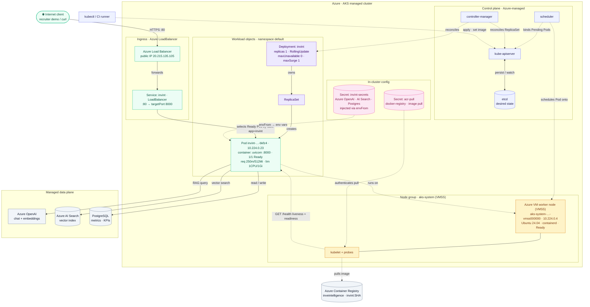
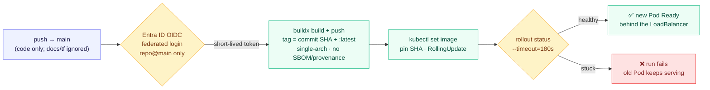

<h1 align="center">Investor Intelligence RAG · on Azure Kubernetes Service</h1>

<p align="center">
  <em>A financial-filings Q&amp;A API running on AKS, shipped by a passwordless GitHub Actions pipeline that signs in to Azure with Microsoft Entra ID.</em>
</p>

<p align="left">
  
  
  
  
  
  
  
  
</p>

---

A Retrieval-Augmented Generation API that answers questions over company financial filings, containerized and running on **Azure Kubernetes Service**. Every push to `main` builds the image, ships it to Azure Container Registry, and rolls it out to the cluster with no manual step in between.

Two things here are worth an experienced reviewer's time. First, the delivery path is **passwordless**: the pipeline authenticates to Azure with Entra ID workload-identity federation, so there is no service-principal secret sitting in GitHub to leak or rotate. Second, the Kubernetes layer is built the way you'd actually run it — a rolling update with `maxUnavailable: 0`, split-purpose health probes, config injected from a Secret and never from git, and a private-registry pull path that fails closed.

The RAG application began as coursework from Krish Naik's Agentic-AI course. What I added is the production delivery layer the course left as an exercise: the Terraform that provisions the cluster, the corrected Kubernetes manifests, and the OIDC CI/CD pipeline. That deployment work is my own.

---

## Cluster architecture

This is the diagram to read first. Solid arrows are the **live request path** a user's HTTP call travels; dashed arrows are the **control, config, and image-pull loops** that Kubernetes runs behind it. Nothing floats — every arrow is a real Kubernetes or Azure interaction, and every value shown is what is running on the cluster right now.



The relationships a reviewer checks first: the request path is **Client → Azure Load Balancer → Service → Pod**, and the Service selects a **Ready** Pod by the `app=invint` label — never the Deployment or ReplicaSet directly. The **scheduler binds Pending Pods to the node**; it schedules Pods, not nodes. The **kubelet** owns two jobs that matter here — it pulls the image using the `acr-pull` credential (the AKS managed-identity `AcrPull` path returns anonymous 401s on this registry, so the pull falls back to an admin-cred `docker-registry` secret), and it runs the health probes. Both liveness and readiness hit `/health`; `maxUnavailable: 0` keeps the old Pod serving until the new one passes readiness, so a rollout never drops traffic. Application config and cloud credentials arrive as env vars from the `invint-secrets` Secret via `envFrom`, so **nothing sensitive is baked into the image or committed to git**.

---

## The delivery pipeline

The cluster above doesn't get touched by hand. This is how a commit becomes the running Pod.



---

## What this demonstrates

| Competency | Where to look |
|------------|---------------|
| Zero-downtime rollout (`maxUnavailable: 0`, old Pod serves until new one is Ready) | [`k8s/deployment.yaml`](k8s/deployment.yaml) → `strategy.rollingUpdate` |
| Split-purpose probes (liveness vs readiness, both `/health`, different delays) | `livenessProbe` / `readinessProbe` in the Deployment |
| Config out of the image — env from a Secret via `envFrom`, nothing in git | `envFrom: secretRef: invint-secrets` |
| Private-registry pull that fails closed | `imagePullSecrets: acr-pull` + the pull note in the diagram |
| Passwordless CI/CD with Entra ID OIDC (no stored SP secret) | [`.github/workflows/deploy.yaml`](.github/workflows/deploy.yaml) → *Azure login (Entra ID OIDC)* |
| Immutable, reproducible deploys (SHA-pinned image, exact rollbacks) | *Compute image tags* + *Deploy to AKS* steps |
| A rollout gate that fails the pipeline on a bad deploy | *Verify rollout* → `kubectl rollout status --timeout=180s` |
| Infrastructure as code, scoped so `destroy` never touches the image | [`terraform/`](terraform/) (cluster + `AcrPull`; registry read as a data source) |

---

## Verified on the live cluster

Real `kubectl` output, not aspirations.

| Signal | Value |
|--------|-------|
| Last pipeline run | `31040823828` · all steps green |
| Build → live rollout | ~1 min 40 sec, fully hands-off |
| Deployed image | `inveintelligence.azurecr.io/invint:f44b60598942` (SHA-pinned) |
| Node | `aks-system-…-vmss000000` · `Ready` · Ubuntu 24.04 · containerd · K8s 1.35 |
| Pod | `invint-…-bkfz4` · `1/1 Running` · 0 restarts · IP `10.224.0.23` |
| Service | `invint` · LoadBalancer · `20.215.135.105:80` → targetPort `8000` |
| Resource footprint | requests `250m / 512Mi` · limits `1 CPU / 1Gi` |
| Long-lived Azure secrets in GitHub | none (OIDC only) |

---

## Design decisions &amp; trade-offs

The choices a reviewer asks "why" about, each one deliberate.

| Decision | Why | Trade-off accepted |
|----------|-----|--------------------|
| **`maxUnavailable: 0` on the rolling update** | The old Pod keeps serving until the new one passes its readiness probe, so a deploy never drops a request. | A rollout needs headroom for one extra Pod (`maxSurge: 1`) while it turns over. |
| **Liveness and readiness split, both on `/health`** | Readiness (10s delay) gates traffic; liveness (30s delay) only restarts a truly hung container. Different delays stop a slow start from being killed as if it were dead. | Both currently share one endpoint; a deeper readiness check on dependencies would be the next refinement. |
| **Config via `envFrom` a Secret, never in the image** | New config keys reach the Pod with zero image rebuilds, and no credential is ever committed. `invint-secrets` is created out-of-band from `.env`. | Config changes are a Secret update plus a restart, not a code change. Single source of truth. |
| **`acr-pull` admin-cred pull secret** | The AKS managed-identity `AcrPull` path returns anonymous 401s on this registry, so the kubelet pulls with a `docker-registry` secret instead. The pull fails closed rather than silently running a stale image. | One credential to manage instead of relying on the identity path. Isolated to image pull and documented, not hidden. |
| **Entra ID OIDC instead of an `AZURE_CREDENTIALS` password** | No long-lived SP secret to rotate or leak; trust is scoped to one repo and branch, and the token expires with the run. | One-time federated-credential setup; more moving parts than pasting a JSON blob. |
| **SHA-pinned image for the rollout, not `:latest`** | "What is running?" has exactly one answer, and rollbacks are exact. | The human-friendly `:latest` tag can drift from what's actually deployed. |
| **`terraform destroy` removes only the cluster** | Registry and resource group are read as data sources, so teardown never deletes the image. | Those resources are managed outside this Terraform, not from one state file. |

The `acr-pull` and the CI-side ACR admin credential are the one deliberate exception to "everything passwordless." On an unconstrained subscription the pull would ride the managed identity's `AcrPull` role and the push would ride the federated principal's, end to end. That's the target; the admin credential is the honest workaround for this environment, called out on purpose rather than papered over.

---

## Repository layout

| Path | Purpose |
|------|---------|
| `app.py`, `main.py`, `routes/`, `rag/`, `llm/`, `ingestion/`, `vectorstore/`, `database/` | The RAG application (FastAPI + Azure OpenAI + Azure AI Search) |
| `dockerfile` | Container image, Python slim, uvicorn on `:8000` |
| `k8s/deployment.yaml`, `k8s/service.yaml` | Kubernetes Deployment + LoadBalancer Service |
| `terraform/` | IaC that provisions the AKS cluster and the `AcrPull` role assignment |
| `.github/workflows/deploy.yaml` | The CI/CD pipeline (build → push → deploy → verify) |
| `CICD_Deployment_Guide.md` | Field-by-field walkthrough of the manifests and workflow |

---

## Run it locally

```bash
uv pip install -r requirements.txt
uvicorn app:app --host 0.0.0.0 --port 8000
# http://localhost:8000  ·  docs at /docs  ·  health at /health
```

Application configuration (Azure OpenAI, AI Search, PostgreSQL) is read from the environment. In the cluster it comes from the `invint-secrets` Kubernetes Secret; locally it comes from a `.env`. Nothing sensitive is ever committed: `.env`, Terraform state, and `*.tfvars` are all gitignored.

## Provision the infrastructure

```bash
cd terraform
terraform init
terraform apply
```

The registry and resource group are read as data sources, so a later `terraform destroy` tears down the cluster and its role assignment while leaving the container image untouched.

---

## More of my work

| Project | What it shows |
|---------|---------------|
| [FastAPI-ML-EKS-Platform](https://github.com/Amith-Ganta/FastAPI-ML-EKS-Platform) | ML inference on EKS: full control-plane diagram, HPA/VPA, Cluster Autoscaler, Prometheus/Grafana, Velero |
| [llmops-deep-agent](https://github.com/Amith-Ganta/llmops-deep-agent) | LangGraph agent on EKS: Helm, HPA load-tested 1→6, cross-provider model fallback, Langfuse tracing, eval gate |
| [Rag-fullstack-docker-AWS](https://github.com/Amith-Ganta/Rag-fullstack-docker-AWS) | Full-stack RAG, Dockerized, CI/CD to EC2 with a health-gated rollout |
| [MCP-Multi-Server](https://github.com/Amith-Ganta/MCP-Multi-Server) | Multi-server Model Context Protocol setup |

---

<sub>The RAG application code originates from Krish Naik's Agentic-AI course. The Terraform, the corrected Kubernetes manifests, and the Entra ID OIDC CI/CD pipeline in this repository are my own deployment work built on top of it.</sub>
